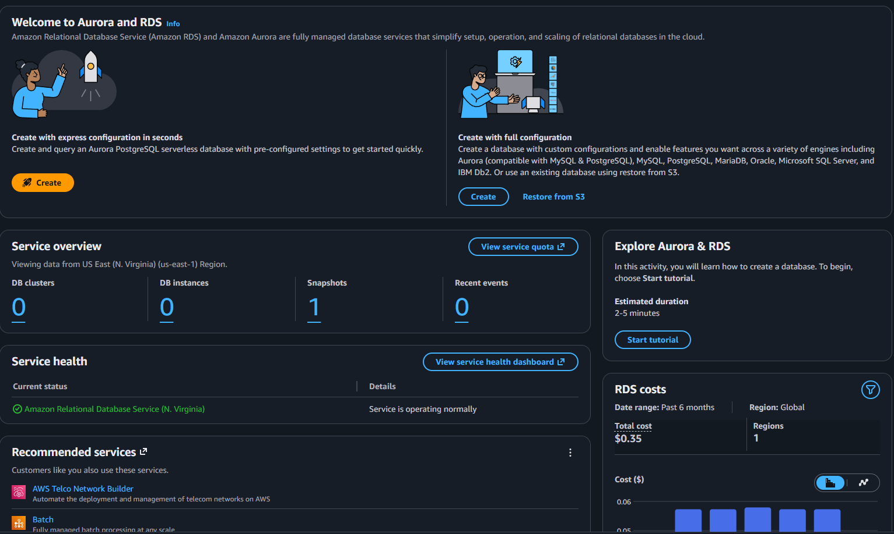
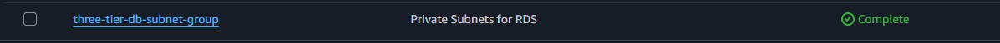
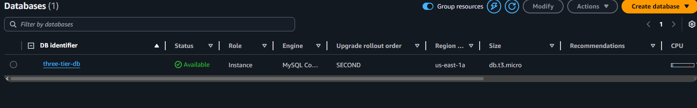
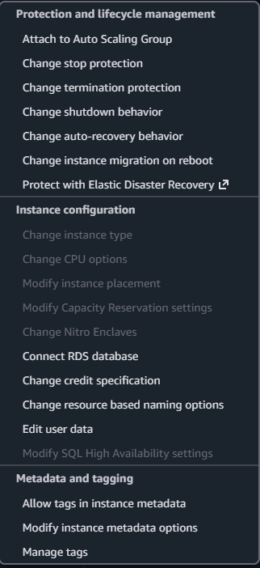

# aws-three-tier-web-application
When it comes to the cloud, being able to architect and know architecture is important for organizations moving or operating in the cloud.

# VPC
The first step is to go to VPCs and click on Create a VPC and choose the VPC and more option name it three-tier-vpc with the IPv4 CIDR as 10.0.0.0/16. Should look like this:   
   
Then scroll down till you see number of availabity zones and have it as 2 with number of public subnets set to 2 and private to 4. Then for NAT gateway set it to zonal and to 1 per AZ with no VPC endpoints for now and enabled DNS hostname and resolution.  
   
Then click on create vpc button at the bottom of the page. Then wait for a few seconds for it to pop up.    
Then go to the VPC dashboard and go to subnets and click on create a subnet. Since there are 6 of six of them it will take a couple seconds.    
For the First subnet name it public-subnet-1a with us-east-1a as its AZ zone with a ipv4 CIDR as 10.0.0.0/16.   
For the second subnet click on create new subnet and name it public-subnet-1b in us-east-1b with IPV4 CIDR as 10.0.16.0/24. Then click on create new subnet. 
For the third subnet, name it private-app-subnet-1a in us-east-1a with the subnet CIDR block as 10.0.50.0/24, Then click on create new subnet. 
For the fourth subnet, name it private-app-subnet-1b in us-east-1b with the subnet CIDR block as 10.0.51.0/24. Then click on create new subnet.
For the fifth subnet, name it private-db-subnet-1a in us-east-1a with the subnet CIDR blick as 10.0.52.0/24. Then click on create new subnet.  
For the sixth subnet, name it private-db-subnet-1b in the us-east-1b with the subnet CIDR block 10.0.53.0/24. Then click on create subnet. 
After that the subnets should be created 

# Security Groups
Then for security groups go to Security groups on the left pane and click on create security group. Name the security group alb-sg with a Description of Allow HTTP/HTTPs from internet with the three tier vpc and inbound rules of type HTTP of source 0.0.0.0/0 and a second rule of HTTPS with 0.0.0.0/0. THen click on Create Security group.  
Then create a second security group named web-server-sg with a description of Allow traffic from ALB and the three-tier vpc with the inbound rules as HTTP and a custom source as alb-sg and a second rule as ssh with 0.0.0.0/0. Then click on create security group.  
Then create a third security group named db-sg with a description of Allow MySQL from web servers and the three tier vpc with the inbound rules set to type as MySQL/Aurora with the source as web-server-sg. Then click on create security group.  

# IAM
Then go to IAM and click on roles in the left pane and click on create role.    
For trusted service choose AWS Service and for use case choose EC2 like so: 
    
Then click on next. Then in permissions choose AmazonSSMManagedInstanceCore and CloudWatchAgentServerPolicy and hit next.   
Name the role EC2-WebServer-Role with the description of allows EC2 instances to use both SSM and CloudWatch. Then click on create role.    

# Database

Then go and search Aurora and RDS and should see this:  
    
In the left panel, click on subnet groups and then click on create DB subnet group.   
Name it three-tier-db-subnet-group with a description saying Private Subnets for RDS, with the three-tier-vpc. In Add Subnets, choose all the us-east-1a and 1b availability zones and for subnets choose the two private-db ones, then hit create and it should appear.    
  
Then go to databases in the left panel and in the middle of the screen, click on create database button and on the dropdown click on full configuration. Then for templates select either Dev/Test or Free Tier.    
Then scroll down to the database settings and name the instance three-tier-db with a username such as admin, then a strong password.    
Then scroll down to instance configuration and select the burstable instance with db.t3g.micro. Then scroll down to storage and for storage type select the General Purpose SSD gp3 with allocated storage of 30 Gigs, enable storage autoscaling with a maximum storage threshold of 100 GB.   
Then scroll down to connectivity and for the vpc, choose three-tier-vpc, then check to make sure db-subnet-group is corrent, no to public access and for VPC security group choose the db-sg. THen scroll down to the additional configuration and for initial database name, name it appdb with a backup retention period of 7 days and encryption enabled. Then click on create database and wait a few minutes for it to configure.
After a few minutes:    
  

# Application layer
Then go to the EC2 side and and on the left side click on launch instance. Name it web-server-template with a description of Template for web servers with Amazon Linux AMI and t2.micro and select on create new key pair and name it three-tier-key with it as RSA and .pem and download it. Then in security groups choose the web-server-sg group and scroll down to advanced details.  
For the IAM Instance profile, choose the EC2-WebServer-Role. Then scroll down to user data and input this:  
#!/bin/bash 
   # Update system  
   dnf update -y    
   
   # Install Apache, PHP, and MySQL client  
   dnf install -y httpd php php-mysqlnd mariadb105  
   
   # Start and enable Apache    
   systemctl start httpd    
   systemctl enable httpd   
   
   # Create simple PHP test page    
   cat > /var/www/html/index.php << 'PHPEOF'    
   <!DOCTYPE html>  
   <html>   
   <head>   
       <title>Three-Tier Application</title>    
        
   </head>  
   <body>   
       
  
           <h1>🚀 Three-Tier Web Application</h1>   
           
<strong>Server:</strong> <?php echo gethostname(); ?>
 
           
<strong>Server IP:</strong> <?php echo $_SERVER['SERVER_ADDR']; ?>
    
           
           <?php    
           // Database connection details   
           $db_host = "YOUR_RDS_ENDPOINT_HERE"; 
           $db_name = "appdb";  
           $db_user = "admin";  
           $db_pass = "YOUR_PASSWORD_HERE"; 
           
           try {    
               $conn = new PDO("mysql:host=$db_host;dbname=$db_name", $db_user, $db_pass);  
               $conn->setAttribute(PDO::ATTR_ERRMODE, PDO::ERRMODE_EXCEPTION);  
               echo '
✓ Database Connection: <strong>SUCCESS</strong>
';  
               
               // Get database version  
               $stmt = $conn->query("SELECT VERSION()");    
               $version = $stmt->fetchColumn(); 
               echo "
Database Version: $version
";    
               
           } catch(PDOException $e) {   
               echo '
✗ Database Connection: <strong>FAILED</strong>
'; 
               echo '
Error: ' . $e->getMessage() . '
'; 
           }    
           ?>   
           
           
 
           
<em>Architecture: ALB → EC2 (Multi-AZ) → RDS (Multi-AZ)</em>
  
       
   
   </body>  
   </html>  
   PHPEOF   
   
   # Set permissions    
   chown -R apache:apache /var/www/html 
   chmod -R 755 /var/www/html   
Then click on create launch template and go to EC2 dashboard -> instances and click on launch instance right down arror and choose launch from template.    
After clicking on it you will be taken to the launch instance from template page and in the source template, you will see the web-server template option and choose it, in summary increase number of instances to 2, then go to network settings and select, for subnet, private-app-subnet-1a and disable auto assign IP and then click on launch instance. Then create a second one with the same format but with the private-app-subnet-1b  
Then go to the RDS dashboard and go to databases and click on the three-tier-db and go to connectivity and security. There will be three options to choose from: code snippet, cloudshell, and endpoint. Click on endpoint and you will find the endpoint in Endpoint & port and copy it. Then go back to the EC2 dashboard to instances and select on either of them and click on actions -> instance settings, then find edit user data like so:  
   
Then go to the db_host and password lines and replace with the arn and password for each.   

# Load Balancer