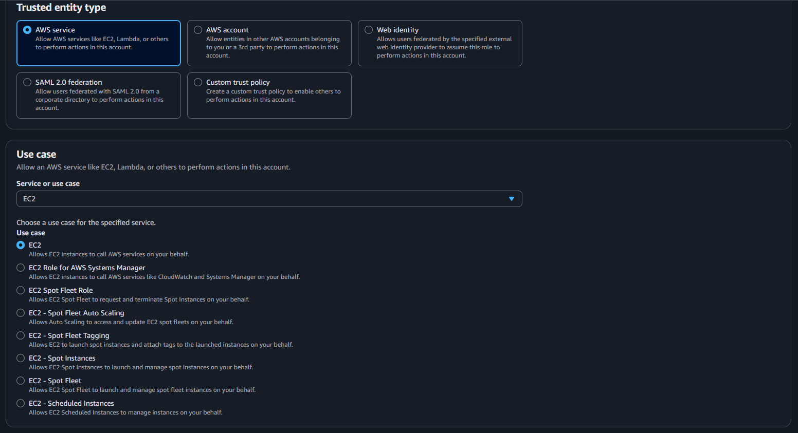

# aws-three-tier-web-application
When it comes to the cloud, being able to architect and know architecture is important for organizations moving or operating in the cloud.

# VPC
The first step is to go to VPCs and click on Create a VPC and choose the VPC and more option name it three-tier-vpc with the IPv4 CIDR as 10.0.0.0/16. Should look like this:   
   
Then scroll down till you see number of availabity zones and have it as 2 with number of public subnets set to 2 and private to 4. Then for NAT gateway set it to zonal and to 1 per AZ with no VPC endpoints for now and enabled DNS hostname and resolution.  
   
Then click on create vpc button at the bottom of the page. Then wait for a few seconds for it to pop up.    
Then go to the VPC dashboard and go to subnets and click on create a subnet. Since there are 6 of six of them it will take a couple seconds.    
For the First subnet name it public-subnet-1a with us-east-1a as its AZ zone with a ipv4 CIDR as 10.0.0.0/16.   
For the second subnet click on create new subnet and name it public-subnet-1b in us-east-1b with IPV4 CIDR as 10.0.16.0/24. Then click on create new subnet. 
For the third subnet, name it private-app-subnet-1a in us-east-1a with the subnet CIDR block as 10.0.50.0/24, Then click on create new subnet. 
For the fourth subnet, name it private-app-subnet-1b in us-east-1b with the subnet CIDR block as 10.0.51.0/24. Then click on create new subnet.
For the fifth subnet, name it private-db-subnet-1a in us-east-1a with the subnet CIDR blick as 10.0.52.0/24. Then click on create new subnet.  
For the sixth subnet, name it private-db-subnet-1b in the us-east-1b with the subnet CIDR block 10.0.53.0/24. Then click on create subnet. 
After that the subnets should be created 

# Security Groups
Then for security groups go to Security groups on the left pane and click on create security group. Name the security group alb-sg with a Description of Allow HTTP/HTTPs from internet with the three tier vpc and inbound rules of type HTTP of source 0.0.0.0/0 and a second rule of HTTPS with 0.0.0.0/0. THen click on Create Security group.  
Then create a second security group named web-server-sg with a description of Allow traffic from ALB and the three-tier vpc with the inbound rules as HTTP and a custom source as alb-sg and a second rule as ssh with 0.0.0.0/0. Then click on create security group.  
Then create a third security group named db-sg with a description of Allow MySQL from web servers and the three tier vpc with the inbound rules set to type as MySQL/Aurora with the source as web-server-sg. Then click on create security group.  

# IAM
Then go to IAM and click on roles in the left pane and click on create role.    
For trusted service choose AWS Service and for use case choose EC2 like so: 
    
Then click on next. Then in permissions choose AmazonSSMManagedInstanceCore and CloudWatchAgentServerPolicy and hit next.   
Name the role EC2-WebServer-Role with the description of allows EC2 instances to use both SSM and CloudWatch. Then click on create role.    

# Database

