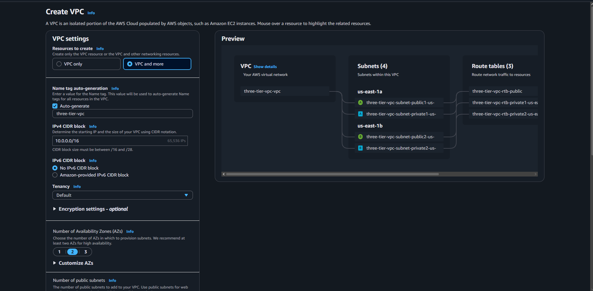
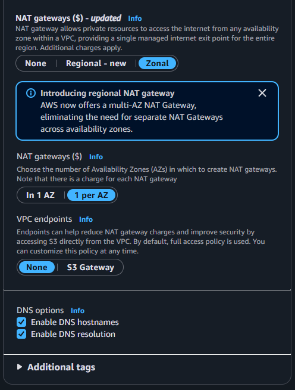

# aws-three-tier-web-application
When it comes to the cloud, being able to architect and know architecture is important for organizations moving or operating in the cloud.

# VPC
The first step is to go to VPCs and click on Create a VPC and choose the VPC and more option name it three-tier-vpc with the IPv4 CIDR as 10.0.0.0/16. Should look like this:   
   
Then scroll down till you see number of availabity zones and have it as 2 with number of public subnets set to 2 and private to 4. Then for NAT gateway set it to zonal and to 1 per AZ with no VPC endpoints for now and enabled DNS hostname and resolution.  
   
Then click on create vpc button at the bottom of the page. Then wait for a few seconds for it to pop up.    
Then go to the VPC dashboard and go to subnets

# Security Groups